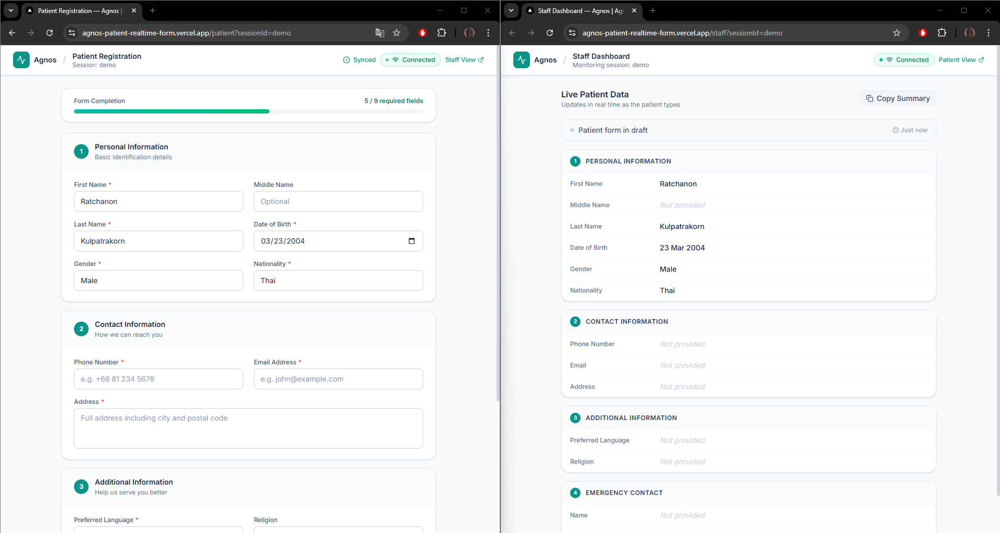

# Agnos Patient Realtime Form

> A production-quality, real-time patient input form and staff monitoring system built as a front-end developer candidate assignment for Agnos.

## Live Demo

| View | URL |
|---|---|
| Landing | `https://agnos-patient-realtime-form.vercel.app/` |
| Patient Form | `https://agnos-patient-realtime-form.vercel.app/patient?sessionId=demo` |
| Staff Dashboard | `https://agnos-patient-realtime-form.vercel.app/staff?sessionId=demo` |

## Screenshots

Open both views side-by-side for the full demo experience:



---

## Tech Stack

| Concern | Choice | Reason |
|---|---|---|
| Framework | Next.js 16 (App Router) + TypeScript | Production-grade, Vercel-native, strict typing |
| Styling | Tailwind CSS v4 | Utility-first, minimal runtime |
| Form management | React Hook Form + Zod | Schema-based validation, performant, type-safe |
| Real-time | **Ably** | Managed WebSocket pub/sub, serverless-compatible, free tier |
| Icons | Lucide React | Lightweight, consistent icon set |
| Date utilities | date-fns | Tree-shakeable, functional date formatting |

---

## Features

### Patient Form
- All required fields: name, DOB, gender, phone, email, address, language, nationality
- Optional fields: middle name, religion, emergency contact
- Schema-based Zod validation with user-friendly error messages
- Required fields marked with `*`
- Email format validation
- International phone number validation
- Form completion progress bar
- Organised into 4 logical sections
- Connection status indicator (Connected / Connecting / Offline)
- Sync status indicator (Typing… / Synced / Not synced)
- Success state after submission with reset option
- Mobile-first responsive design

### Staff Dashboard
- Real-time updates as patient types (no page refresh)
- Highlights the field currently being edited
- Shows patient activity status (typing / draft / submitted)
- Shows last updated time
- Shows connection status
- Copy patient summary to clipboard
- Graceful empty state before any data arrives
- Reconnection banner on connection loss

### Real-time
- Debounced publish (300ms) to avoid flooding
- Events: `patient:update`, `patient:typing`, `patient:submit`, `patient:reset`
- Session-scoped channels (`?sessionId=demo` by default)
- Abstracted realtime layer — swap Ably for another provider by changing one file

---

## Setup Instructions

### 1. Clone the repository

```bash
git clone https://github.com/your-username/agnos-patient-realtime-form.git
cd agnos-patient-realtime-form
```

### 2. Install dependencies

```bash
npm install
```

### 3. Configure environment variables

```bash
cp .env.example .env.local
```

Edit `.env.local` and add your Ably API key (see [Environment Variables](#environment-variables) below).

### 4. Run locally

```bash
npm run dev
```

Open:
- **Landing page**: http://localhost:3000
- **Patient Form**: http://localhost:3000/patient?sessionId=demo
- **Staff Dashboard**: http://localhost:3000/staff?sessionId=demo

> **Tip:** Open the patient and staff URLs in two separate browser windows side-by-side.

---

## Environment Variables

| Variable | Required | Description |
|---|---|---|
| `NEXT_PUBLIC_ABLY_API_KEY` | Yes | Ably API key with Publish + Subscribe capabilities |

### Getting an Ably API Key (free)

1. Sign up at [ably.com](https://ably.com) — no credit card required.
2. Create a new App from the dashboard.
3. Go to **API Keys** tab.
4. Copy the key that has **Publish** and **Subscribe** capabilities.
5. Paste into `.env.local`.

> **Security note:** The `NEXT_PUBLIC_` prefix exposes the key in the client bundle. This is acceptable for demo/assignment purposes. For production, use [Ably Token Authentication](https://ably.com/docs/auth/token) via a secure server endpoint to avoid exposing the root API key.

---

## How to Open Both Views

```bash
# Terminal 1 — start dev server
npm run dev

# Open in browser window 1
open http://localhost:3000/patient?sessionId=demo

# Open in browser window 2 (or a second monitor)
open http://localhost:3000/staff?sessionId=demo
```

Type in the patient form — you will see the staff dashboard update in real time.

---

## Real-time Synchronization Explanation

```
Patient Browser                   Ably Cloud                  Staff Browser
     │                                │                               │
     │  type in field (debounce 300ms)│                               │
     │──publish(patient:update)──────▶│                               │
     │                                │──push(patient:update)────────▶│
     │                                │                               │ update UI
     │  focus a field                 │                               │
     │──publish(patient:typing)──────▶│                               │
     │                                │──push(patient:typing)────────▶│
     │                                │                               │ highlight field
     │  submit form                   │                               │
     │──publish(patient:submit)──────▶│                               │
     │                                │──push(patient:submit)────────▶│
     │                                │                               │ show submitted banner
     │  reset form                    │                               │
     │──publish(patient:reset)───────▶│                               │
     │                                │──push(patient:reset)─────────▶│
     │                                │                               │ clear data
```

**Channel naming:** Each session uses a dedicated Ably channel: `agnos-patient:{sessionId}`.
The default session is `demo`. Multiple patient/staff pairs can run simultaneously using different `?sessionId=` query parameters.

**Debounce strategy:** Patient form changes are debounced at 300ms before publishing a `patient:update` event. This keeps the staff view feeling live while preventing flooding Ably with every keystroke.

**Typing events:** When the patient focuses a field, a `patient:typing` event is published immediately. These are not debounced. The staff view shows a typing indicator that auto-clears after 3 seconds of inactivity.

---

## Deployment

This project is optimized for zero-config deployment on **Vercel**.

1. Push your repository to GitHub.
2. Import the project in the Vercel dashboard.
3. Add the `NEXT_PUBLIC_ABLY_API_KEY` environment variable.
4. Deploy.

*(Alternatively, you can deploy via CLI using `npx vercel`)*


---

## Bonus Features Implemented

- **Session Isolation:** Supports multiple concurrent demonstrations via the ?sessionId= query parameter.
- **Copy Summary:** One-click copy of the patient's data on the Staff Dashboard.
- **Typing Indicator:** Real-time visual cue showing exactly which field the patient is currently editing.
- **Connection Resilience:** UI gracefully handles and displays offline/reconnecting states if the real-time connection drops.
